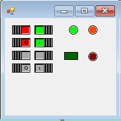

# VSIXControls

[See the English version of this file](README.en.md)

_Controles de usuario para Windows Forms en Visual Studio_

----

## Descripción 👀

En este proyecto se crean una serie de `controles de usuario` como extensión del IDE `Visual Studio` de Microsoft. La instalación de los controles se realiza de forma sencilla y pueden ser utilizados en cualquier proyecto de escritorio de `Windows Forms`.

El proyecto es de código abierto y se distribuye como software libre, por lo que cualquiera puede usar los controles en sus proyectos y/o modificarlos.

En la versión actual se han implementado dos controles:
> - **Switch** : Un control con la apariencia de un interruptor con dos estados (Encendido y apagado) 
> - **LED**    : Un indicador simulando un piloto led tambien con dos estados (Encendido y apagado)

## Controles :round_pushpin:

### Switch 

Simula un microinterruptor. En la actual versión tiene la apariencia de un microinterruptor de tipo deslizante con la palanca cuadrada. Hereda sus propiedades, métodos y eventos de la clase *`UserControl`* y ademas implementa los siguientes:

> #### Propiedades :triangular_ruler:

- **IsON** : Propiedad de tipo *'bool'*. Establece o devuelve el estado del control, *`true`* si el interruptor está en posición ON o *`false`* si el interruptor está en posición OFF. Aparece en la pestaña *Comportamiento* en la ventana de *Propiedades* de Visual Studio.
- **Colored** : Propiedad de tipo *`bool`*. Determina si el control muestra los colores 'BackgroundON' y 'BackgroundOFF' o solamente un fondo gris. 
Aparece en la pestaña *Apariencia* en la ventana de *Propiedades* de Visual Studio.
- **BackgrounON** : Propiedad de tipo *`Color`*. Establece el color del fondo cuando el estado es 'ON' (IsON = true) y la propiedad *`Colored`* es 'true'. Aparece en la pestaña *Apariencia* en la ventana de *Propiedades* de Visual Studio.
- **BackgroundOFF** : Propiedad de tipo *`Color`*. Establece el color del fondo cuando el estado es 'OFF' (IsON = false) y la propiedad *`Colored`* es 'true'. Aparece en la pestaña *Apariencia* en la ventana de *Propiedades* de Visual Studio.
- **ShowLabels** : Propiedad de tipo *`bool`*. Determina si el control muestra los caracteres '1' y '0' indicando el estado del control.  Aparece en la pestaña *Apariencia* en la ventana de *Propiedades* de Visual Studio.
- **LabelColor** : Propiedad de tipo *`Color`*. Establece el color de las etiqueta '1' y '0' visibles si ShowLabels es 'true'. Aparece en la pestaña *Apariencia* en la ventana de *Propiedades* de Visual Studio.

> #### Eventos :zap:

- **IsONChanged** : Se produce cuando el Switch cambia de estado ON/OFF. El evento es invocado cuando la propiedad *`IsON`* cambia su valor

## Led 

Simula un diodo LED de los que se utilizan como pilotos. Se puede cambiar el color cuando está encendido y cuando está apagado y puede ser redondo o rectangular. Hereda sus propiedades, métodos y eventos de la clase *`UserControl`* y ademas implementa los siguientes:

> #### Propiedades :triangular_ruler:

- **IsON** : Propiedad de tipo *`bool`*. Estado del LED encendido (IsON = true) o apagado (IsON = False). Aparece en la pestaña *Comportamiento* en la ventana de *Propiedades* de Visual Studio.
- **Appearance** : Propiedad de tipo *`Appearances`* que puede tomar los valores *`Round`* o *`Square`*. Establece la 'forma' del control: redondo o cuadrado. Aparece en la pestaña *Apariencia* en la ventana de *Propiedades* de Visual Studio.
- **LedColorON** : Propiedad de tipo *`Color`*. Establece el color del Led cuando el estado es 'Encendido' (IsON = true). Aparece en la pestaña *Apariencia* en la ventana de *Propiedades* de Visual Studio.
- **LedColorOFF** : Propiedad de tipo *`Color`*. Establece el color del Led cuando el estado es 'Apagado' (IsON = false). Aparece en la pestaña *Apariencia* en la ventana de *Propiedades* de Visual Studio.

### Instalación :electric_plug:

Esta extensión está publicada en ***Visual Studio Marketplace***.
Existen varias formas de instalar esta extensión:

#### - Con Administrador de Extensiones

>1. Entre en Visual Studio IDE
>2. Abra el cuadro de diálogo *`Administrador de extensiones`* usando el menú *`Extensiones > Administrar extensiones`*.
>3. En el cuadro *`Administrador de extensiones`* busque la extensión, por ejemplo, poniendo en el cuadro de búsqueda *VSIXControls*
>4. Pulse el botón *`Instalar`*.
>5. Reinicie Visual Studio IDE.

#### - Sin Administrador de Extensiones

Tambien se puede instalar el archivo .vsix si se hace **doble clic en él** o si se selecciona y se presiona ENTRAR. Después de eso, solo tiene que seguir las instrucciones.
Una vez instalada la extensión, puede usar el cuadro de diálogo Administrar extensiones para habilitarla, deshabilitarla o desinstalarla.

El proceso sería:

>1. Descargar el archivo ***`VSIXControls.vsix`*** del último release de mi [repositorio de GitHub](https://github.com/cxrc/VSIXControls/releases/latest) o de la web de [Visual Studio Marketplace](https://marketplace.visualstudio.com/items?itemName=RafaelCarballoVazquez.VSIXControls)
>2. Situarse en el archivo en nuestro PC y hacer **doble click** en él (o seleccionarlo y pulsar ENTRAR)
>3. Seguir las instrucciones que aparecen en pantalla.

### Desinstalación :x:

Si desea dejar de usar la extensión, puede deshabilitarla o desinstalarla.
Al deshabilitar una extensión esta sigue instalada pero está descargada.

>1. En Visual Studio abra *`Extensiones > Administrar extensiones`*
>2. En *`Instaladas`* busque la extensión **VSIXControls**.
>3. Haga clic *`Desinstalar`* o *`Deshabilitar`*.
>4. Reinicie Visual Studio.

## Construido con 🛠️

* [Microsoft Visual Studio Community 2019](https://visualstudio.microsoft.com/es/vs/community/)
* Fuente escrita en ***C#***

## Wiki 📖

Puedes encontrar mucho más de cómo utilizar este proyecto en nuestra [Wiki](https://github.com/cxrc/VSIXControls/wiki)

## Autor ✒️

* **Rafael Carballo Vázquez** - [cxrc](https://github.com/cxrc)

## Licencia 📄

Este proyecto es software libre. Está permitido usarlo, copiarlo, modificarlo, etc. - mira el archivo [LICENSE.md](LICENSE) para detalles

---
